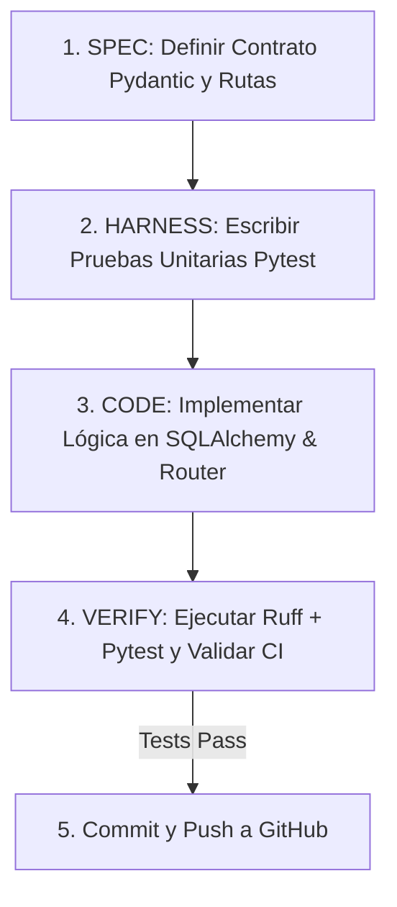

# 🛠️ Guía de Desarrollo Asistido por IA con Gentle-AI & SDD
## Metodología: Spec-Driven Development (SDD) + Arneses de Calidad

> **Propósito:** Esta guía define el flujo de trabajo estricto que Cristian, Matías y los agentes de IA deben seguir para implementar cada Historia de Usuario de Jira (`INVENTARIO-X`).

---

## 🔁 El Ciclo de 4 Pasos de Spec-Driven Development (SDD)



### Paso 1: Especificar (*Spec*)
* Antes de escribir la lógica, define los esquemas Pydantic en `backend/app/schemas/`:
  * `ItemCreate`, `ItemResponse`, `MovimientoCreate`, `InspeccionRequest`, etc.
* Define la firma del router en `backend/app/routers/` con tipos estrictos.

### Paso 2: Crear el Arnés de Pruebas (*Harness*)
* En `backend/tests/`, escribe la prueba unitaria que valida el comportamiento esperado según los **Criterios de Aceptación de Jira**.
* La prueba debe validar tanto el camino feliz (código 200/201) como los casos de error (código 400/404/422).

### Paso 3: Implementar (*Code*)
* Implementa la lógica de base de datos con SQLAlchemy 2.0 y el controlador de FastAPI.
* El agente está restringido por `.gentle/config.json` a no inventar campos fuera de `01_modelo_datos_mer_v3.spec.md`.

### Paso 4: Verificar (*Verify*)
* Ejecuta en la terminal de Codespaces:
  ```bash
  ruff check .
  PYTHONPATH=. pytest tests/
  ```
* Si todo pasa, haz `git push`. GitHub Actions ejecutará automáticamente el pipeline de CI.

---

## 🎯 Lista de Módulos a Desarrollar (Por Sprints)

1. **Sprint 0: `core` y `auth` (Autenticación JWT & RBAC):**
   * Endpoint de login, generación de token JWT, middleware de verificación de roles (`DIRECTOR`, `CAPITAN`, `BOMBERO`).
2. **Sprint 1: `catalogo` y `ubicaciones`:**
   * CRUD de Items, gestión de stock agrupable vs etiquetable QR, jerarquía reflexiva de ubicaciones (carros y bodegas).
3. **Sprint 2: `inspecciones`, `movimientos` y `alertas`:**
   * Recuento móvil post-emergencia, detección de discrepancias teóricas vs encontradas, ledger append-only de movimientos.
4. **Sprint 3: `reportes` y `dashboard`:**
   * Consolidado patrimonial para el Director, exportación PDF/Excel y cierre de discrepancias con autorización.
